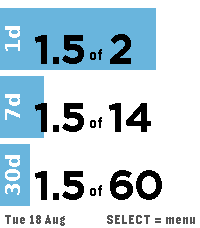
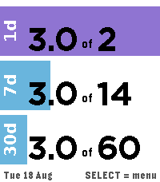
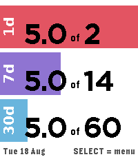
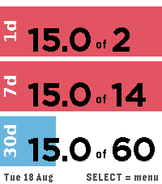
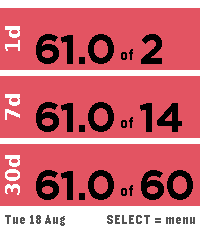
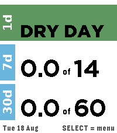
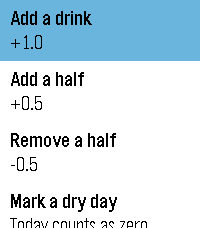
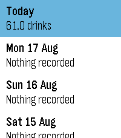
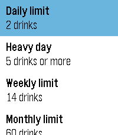
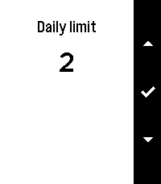

# Tally — a drink counter for the Pebble Time 2

A watchapp for the Pebble Time 2 (`emery`, 200×228, 64 colours) that tracks
standard drinks and shows three rolling totals — today, the last 7 days and the
last 30 days — as stacked bars that recolour as you pass your limits.



Built and verified on the `emery` QEMU emulator — every screenshot below is a
real capture from the running app.

## Colour rules

| Bar | Blue | Purple | Red | Green |
|---|---|---|---|---|
| **1d** (today) | at or under the daily limit | over the daily limit (default: more than 2) | at or over the heavy-day threshold (default: 5 or more) | today marked as a dry day |
| **7d** (rolling week) | otherwise | today hit the heavy-day threshold | rolling 7-day total is over the weekly limit | — |
| **30d** (rolling month) | otherwise | — | rolling 30-day total is over the monthly limit | — |

Red always wins over purple. A dry day shows **DRY DAY** in place of the numbers
and fills the whole daily bar green.

| 3 drinks | 5 drinks | week over | month over | dry day |
|---|---|---|---|---|
|  |  |  |  |  |

At 3 the daily bar is purple and the week is still blue; at 5 the daily bar goes
red and the week turns purple; past 14 in the rolling week the week bar goes red;
past 60 in the rolling month the month bar goes red too.

## Rolling windows, not calendar periods

The 7- and 30-day figures are trailing windows that always end on today: the
week total is the sum of today plus the previous 6 days, the month total is
today plus the previous 29. Nothing resets at midnight on a Sunday or on the
1st of the month — the numbers only ever roll forward one day at a time.

Per-day totals are kept in a 40-slot ring buffer in
[`persist`](https://developer.repebble.com/) storage (about 136 bytes), indexed
by the local day number. On launch, and on the hour while the app is open, every
day that has elapsed since the last run is cleared, so a stale slot can never be
counted as today.

## Bar length

Each bar is the coloured label block plus the share of the remaining width the
value has used of *its own* limit, clamped to full once the limit is passed. So
a bar that is half way across means half the allowance for that window is gone,
and the colour change and the length agree with each other. (In the reference
screenshot the bars are scaled relative to each other rather than to their
limits; absolute fill was chosen here because it is what makes the bar readable
as "how much of my allowance is left".)

## Controls

| Button | Action |
|---|---|
| **Up** | +1.0 drink |
| **Down** | −1.0 drink (undo a mistake) |
| **Select** | Menu |
| **Back** | Exit |

The menu holds: add a drink, add a half, remove a half, mark/clear a dry day,
**History** (the last 14 days) and **Limits**.

| Menu | History | Limits | Editing a limit |
|---|---|---|---|
|  |  |  |  |

Limits are editable in whole drinks and default to 2 a day, 5 for a heavy day,
14 a week and 60 a month. The watch buzzes once when a drink takes you past the
daily limit and twice when it takes you to the heavy-day threshold.

Leaving the app writes an App Glance line — `1.5 of 2 today` — under the app in
the launcher.

Amounts are stored in tenths of a drink so there is no floating-point maths
anywhere in the app.

## Layout

Everything derives from `layer_get_bounds()`, but the design targets emery:

```
row height 62, gap 6, top margin 8
row 0: y   8 → 70
row 1: y  76 → 138
row 2: y 144 → 206
footer: y 210 → 228   (date, and the Select hint)
label block: x 0 → 26
```

The number line steps down through `BITHAM_42_BOLD → BITHAM_30_BLACK →
GOTHIC_28_BOLD → GOTHIC_24_BOLD → GOTHIC_18_BOLD`, measuring each with
`graphics_text_layout_get_content_size()` and using the largest that fits the
row, so `39.7 of 60` cannot spill off the right edge.

## The sideways labels

The Pebble SDK cannot rotate text at draw time, so `1d`, `7d` and `30d` are
pre-rendered as white-on-transparent PNGs and composited with `GCompOpSet`.
Regenerate them (after changing the font or size) with:

```sh
python3 tools/make_labels.py    # needs Pillow and a DejaVu/Liberation font
```

## Building

Needs the [`pebble` tool](https://developer.repebble.com/sdk/) with an SDK
installed:

```sh
pip install pebble-tool
pebble sdk install latest
pebble build                          # -> build/pebble-drink-counter.pbw
pebble install --emulator emery       # run it in QEMU
```

A pre-built bundle is committed at [`dist/tally.pbw`](dist/tally.pbw) if you
just want to install it.

To get it onto a real Pebble Time 2: copy the `.pbw` to your phone and open it
with the Pebble app, or enable developer mode in the app and run
`pebble install --phone <phone-ip>`.

### Building without `sdk.repebble.com`

`pebble sdk install` fetches the SDK from `sdk.repebble.com`. If that host is
unreachable, the SDK can be generated from the firmware sources instead — which
is how this app was built and tested here:

```sh
curl -LsSf https://github.com/coredevices/PebbleOS-SDK/releases/latest/download/pebbleos-sdk-installer.sh | sh
git clone --recurse-submodules https://github.com/coredevices/pebbleos
cd pebbleos && python3 -m venv .venv && ./.venv/bin/pip install -r requirements.txt
. /opt/pebbleos-sdk/env.sh && export PATH="$PWD/.venv/bin:$PATH"
./pbl configure --board=qemu_emery && ./pbl build       # produces build/sdk/emery
./pbl waf qemu_image_micro && ./pbl waf qemu_image_spi   # emulator flash images
pebble sdk install --tintin /path/to/pebbleos
```

Two things needed patching for that route to work on Linux: `build/sdk/common/
waftools/resources/resource_map/pblpng_optimize.py` is missing from the
generated SDK (copy it from `tools/resources/resource_map/`), and `pypkjs` binds
its websocket to an IPv6 wildcard, which fails on an IPv4-only host (bind
`127.0.0.1` in `pypkjs/runner/websocket.py`).

## Files

```
package.json            app manifest (uuid, emery target, bitmap resources)
wscript                 stock Pebble waf build script, no pkjs
src/c/main.c            the whole app
resources/images/*.png  pre-rendered sideways row labels
tools/make_labels.py    regenerates those labels
dist/tally.pbw          built bundle, installable as-is
shots/                  emulator captures used in this README
```

Footprint on emery: 5,697 bytes of RAM, 4,514 bytes of resources, and the heap
report on exit shows `Still allocated <0B>`.
